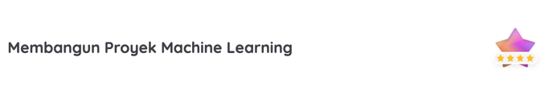

# Project Submission for Proyek Analisis Data - Dicoding

## About This Project
This project is learning project for me to learn 
Clustering and Classification from dicoding.

## Data
1. **Source of Dataset**: 
This dataset is obtained from [Kaggle](https://www.kaggle.com/datasets/valakhorasani/bank-transaction-dataset-for-fraud-detection/data).
2. **About Dataset**: 
The dataset contains 2512 samples of transaction data, including transaction attributes. For example: customer demographics and usage patterns. Each data offers insights into transaction behavior for analysing financial security and fraud detection applications. 

## Learning Obtained
1. **Clustering**: Clustering the dataset to find the patterns in the data. Then, make it as the label.
2. **Classification**: Using the clustering result as the label, I classify the data based on that label.

## How to run 
1. Clone this repository
2. Create a virtual environment
3. Install the requirements
4. Run the notebook